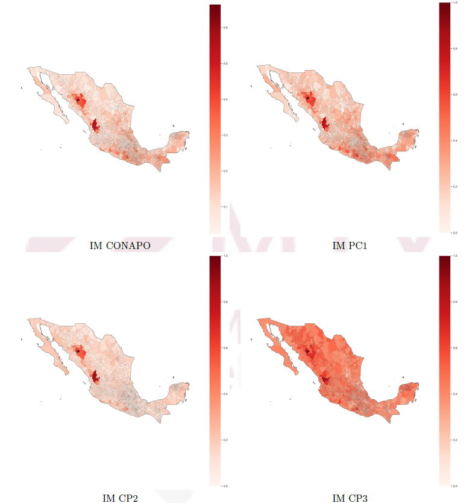
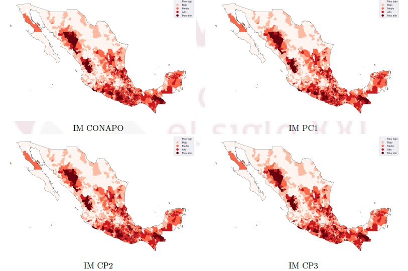

# Propuesta de índice de marginación para los municipios de México

Este proyecto propone un **índice alternativo de marginación** para los municipios de México, utilizando indicadores del **Consejo Nacional de Población (CONAPO)**.  

El CONAPO publica un índice de marginación calculado con fórmulas específicas; en este caso, se plantea una alternativa basada en técnicas de **Machine Learning**, particularmente en el **Análisis de Componentes Principales (PCA)**.

## Enfoque de solución

El análisis se centró en la implementación del **PCA**, una técnica fundamental en estadística multivariada, cuyo objetivo fue **explorar y comprender la variabilidad en el conjunto de datos**.  

Este procedimiento se aplicó a nueve variables indicadoras:  
- Población analfabeta (ANALF)  
- Población sin educación básica (SBASC)  
- Viviendas sin drenaje (OVSDE)  
- Viviendas sin energía eléctrica (OVSEE)  
- Viviendas sin agua entubada (OVSAE)  
- Viviendas con piso de tierra (OVPT)  
- Viviendas con hacinamiento (VHAC)  
- Población con menos de 5000 habitantes (PL.5000)  
- Población con ingresos menores a dos salarios mínimos (PO2SM)  

El PCA no solo facilita la **reducción de dimensionalidad**, sino que también permite **revelar patrones y relaciones subyacentes** entre las variables que contribuyen al índice de marginación, ofreciendo una manera eficiente de resumir la información de los nueve indicadores.  

## Resultados

Los resultados obtenidos mediante PCA muestran una **representación satisfactoria**, comparable con el índice publicado por CONAPO. En general, los valores calculados presentan una alta similitud con los resultados oficiales, lo que valida la propuesta.  

## Archivos del repositorio

- **código.ipynb**  
  Contiene la implementación del método PCA.  

- **mg2021_integrado_tarea, national**  
  Carpetas con archivos necesarios para graficar el mapa de México y visualizar de mejor manera los índices.  

- **IMM_2020.xls**  
  Base de datos con todos los indicadores utilizados y otros adicionales.  

- **IMM_2020_1.xls, IMM_2020_2.xls, IMM_2020_3.xls**  
  Archivos donde se guardan las componentes principales obtenidas, que representan los índices de marginación.  

- **reporte.pdf**  
  Documento con la explicación y los resultados del análisis.  

---

*Los datos oficiales pueden obtenerse en el siguiente enlace:*  
[Índices de marginación 2020 - CONAPO](https://www.gob.mx/conapo/documentos/indices-de-marginacion-2020-284372)

**Indice de marginación continuo en [0,1] para distintos componentes**

**Índice de margicación categórico para distintos componentes**

